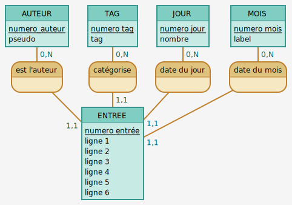

# Conception

## MCD

[Mocodo](http://mocodo.wingi.net/)

```cmd
AUTEUR: numero_auteur, pseudo
TAG: numero tag, tag
JOUR : numero jour, nombre
MOIS: numero mois, label

est l'auteur, 0N AUTEUR, 11 ENTREE
catégorise, 0N TAG, 11 ENTREE
date du jour, 0N JOUR, 11 ENTREE
date du mois, 0N MOIS, 11 ENTREE

ENTREE: numero entrée, ligne 1, ligne 2, ligne 3, ligne 4, ligne 5, ligne 6
```



## MLD

**auteur**(<ins>id</ins>, pseudo)
**tag**(<ins>id</ins>, tag)
**jour**(<ins>id</ins>, numero)
**mois**(<ins>id</ins>, label)
**entree**(<ins>id</ins>, ligne1, ligne2, ligne3, ligne4, ligne5, ligne6, #auteur(id), #tag(id), #jour(id), #mois(id))

## Seeding

To seed

```cmd
psql -U <user> -d <db> -f conception/seeding.sql
```

## Sqitch

To init Sqitch on new project

```cmd
sqitch init project_name --engine pg --target db:pg:my_db --top-dir migrations
```
